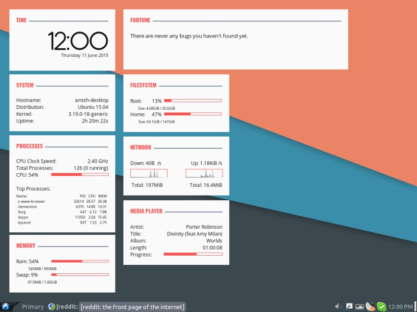

conky-cards
===========

This conky setup consists of eight individual conky scripts ("cards") which display
* Date and time
* General system information
* Processes (top processes and usage)
* Memory and swap usage
* A "fortune" message from `fortune`
* Disk usage
* Network usage
* Metadata of the current track playing

Screenshots
===========





Installation
===========

#### Requirements

Install `conky` , preferably the package `conky-all` if in the future you want to use some exotic features  
For the mediaplayer "card", you need `python3`  
For the fortune "card", you need `fortune`  
The script uses the following fonts, install them
(see Customization if you wish to use your fonts)
* Antipasto [Download here](http://www.dafont.com/antipasto.font)
* Open Sans [Download here](http://www.fontsquirrel.com/fonts/open-sans)
* Oswald [Download here](http://www.fontsquirrel.com/fonts/oswald)

Copy/Move the contents to a directory of your liking and edit the following files to specify this directory by replacing `INSERT_PATH` to your directory. e.g. if the scripts are in `/home/foo/path/to/my/dir` then run
```
$ cd /home/foo/path/to/my/dir
$ sed -i 's:INSERT_PATH:/home/foo/path/to/my/dir:' mediaplayer_rc launch_all.sh
```

Now, set `launch_all.sh` as executable (`chmod u+x launch_all.sh`) and run it. If you're on Plasma, that's it.

Otherwise, on other platforms you might have to uncomment the sleep line in that script and add the script to your startup applications.
If you don't know how, Google is your friend.
For non-plasma systems, if **after** 10-15 seconds, you don't see conky on your desktop, try running:
```
sed -i -r 's/own_window_type .*/own_window_type normal/' *_rc
```


Customization
=================

**Network**

You might want to replace `enp0s20u1` in `network_rc` with the device you are connected to the internet with similarly for the wifi device e.g.
```
$ sed -i 's/enp0s20u1/enp0s30u1/' network_rc
```

**Media Player**

Replace `clementine` in `mediaplayer_rc` with the name of your media player (e.g. `vlc`, or `audacious`, or `spotify`).  
This should probably just work (after replacement) if the media player you are using implements MPRIS 2.0 (most players do).
To customize the output, you might want to see `python3 mediaplayer.py --help`

**Fortune**

See `man fortune` and edit the arguments to the fortune call in `fortune_rc`


**Colors**

Each script uses a set of three colors, defined as
* color1 (color)  
Color of the Card heading
* color2 (color)  
Color of the horizontal line stretching from the heading to the right end
* color3 (color)  
Text color  
Here, (color) can be specified using the hexadecimal notation (without the preceding #) or a color name specified in `/usr/share/X11/rgb.txt`  
Examples of legit colors : red, blue, 20efef  
You can change any of the above colors to suit your liking/theme
Examples:  
If you want headings in blue, then run  
```
$ sed -i -r "s/color1 = '.*'$/color1 = '#0000ff'/" *_rc

```

Similarly, you can change the background color of the 'cards' specified by the variable `own_window_colour`
Background opacity is specified by `own_window_argb_value (value between 0 and 255)`


**Fonts**

The following fonts are used
* Antipasto [Download here](http://www.dafont.com/antipasto.font)  
Font in the which the clock is displayed
* Open Sans [Download here](http://www.fontsquirrel.com/fonts/open-sans)  
Font for the general text
* Oswald [Download here](http://www.fontsquirrel.com/fonts/oswald)  
Font for the Cards' headings

Substitue them using sed like above.


Author
========
Amish Naidu  http://amhndu.github.io
